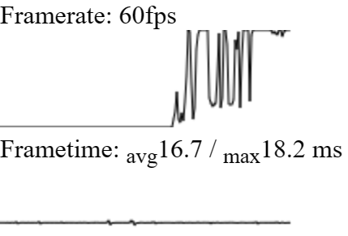

# FuegoHud

An overlay for monitoring FPS and Frametime on browser, similar to [MangoHud](https://github.com/flightlessmango/MangoHud) and MSI Afterburner (RivaTuner).

## Installation

[Tampermonkey (GitHub)](https://raw.githubusercontent.com/p-toy-factory/fuego-hud/main/dist/index.user.js)
